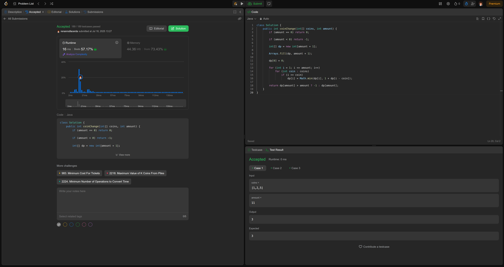
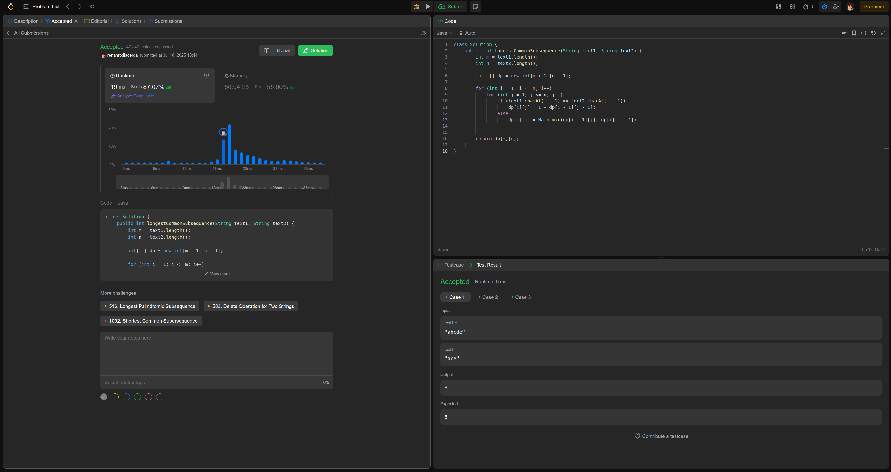
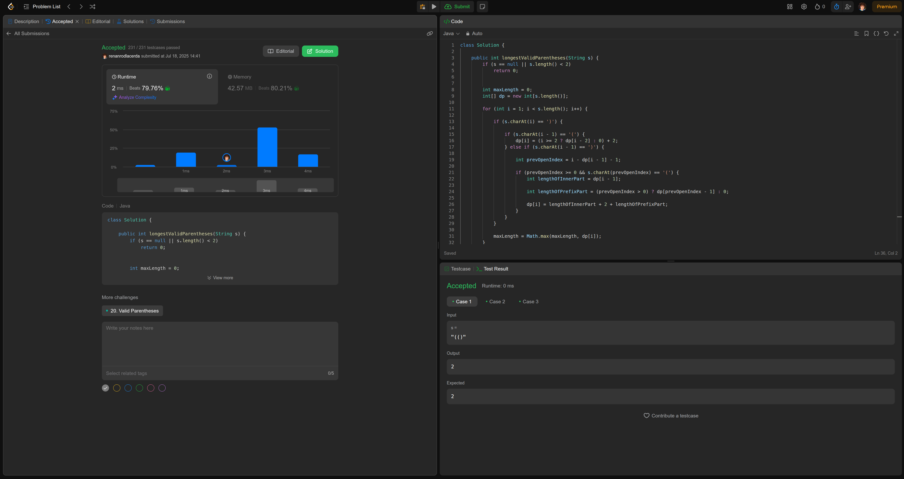
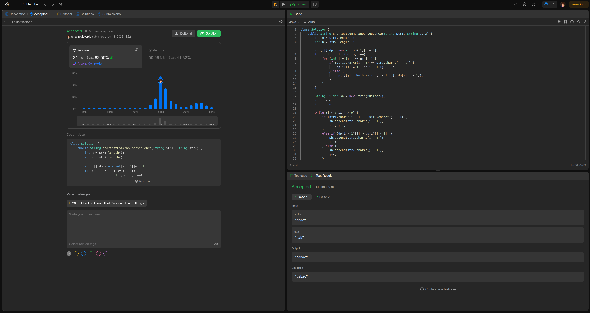

# Projeto de Algoritmos - Programação Dinâmica

**Número da Lista**: 5
<br>**Conteúdo da Disciplina**: Programação Dinâmica

## Aluno

| Matrícula  | Nome                         |
| ---------- | ---------------------------- |
| 190048191| Renan Rodrigues Lacerda |

## Link vídeo: [video](#)

## Sobre

Este repositório contém soluções para alguns problemas da plataforma LeetCode, todos resolvidos utilizando o paradigma de Programação Dinâmica (PD). O objetivo é demonstrar a aplicação prática desta estratégia em diferentes cenários, especialmente em problemas de otimização e manipulação de sequências.

A abordagem de Programação Dinâmica consiste em resolver problemas complexos quebrando-os em subproblemas menores e sobrepostos. As soluções para esses subproblemas são armazenadas (geralmente em um array ou matriz) para evitar recálculos, levando a soluções muito mais eficientes em comparação com abordagens recursivas puras.

As duas principais técnicas de PD são:
1.  **Memoização (Top-Down)**: Uma abordagem recursiva que armazena o resultado de cada subproblema na primeira vez que é calculado.
2.  **Tabulação (Bottom-Up)**: Uma abordagem iterativa que preenche uma tabela de resultados de baixo para cima, começando pelos casos base.

As soluções neste projeto utilizam principalmente a abordagem de Tabulação (Bottom-Up).

## Visão Geral dos Problemas

### 1. Coin Change
**Link do problema**: [leetcode.com/problems/coin-change](https://leetcode.com/problems/coin-change/description/)<br>
**Descrição**: Dado um conjunto de moedas de diferentes denominações e um valor total, o desafio é encontrar o número mínimo de moedas para formar esse valor. A solução de PD constrói um array `dp` onde `dp[i]` armazena a quantidade mínima de moedas para o valor `i`.
**Abordagem**: Programação Dinâmica (Bottom-Up) - $O(\text{valor} \times \text{moedas})$.

### 2. Longest Common Subsequence
**Link do problema**: [leetcode.com/problems/longest-common-subsequence](https://leetcode.com/problems/longest-common-subsequence/description/)<br>
**Descrição**: Dadas duas strings, o objetivo é encontrar o comprimento da subsequência comum mais longa. A solução utiliza uma matriz 2D `dp[i][j]` para armazenar o comprimento da LCS entre os prefixos das strings. É um problema fundamental de PD em strings.
**Abordagem**: Programação Dinâmica (Bottom-Up) - $O(m \times n)$.

### 3. Longest Valid Parentheses
**Link do problema**: [leetcode.com/problems/longest-valid-parentheses](https://leetcode.com/problems/longest-valid-parentheses/description/)<br>
**Descrição**: Encontrar o comprimento da substring de parênteses bem formada mais longa. A solução de PD utiliza um array `dp[i]` para armazenar o comprimento da substring válida que termina no índice `i`. A lógica da recorrência lida com os padrões `()` e `(())` para construir a solução.
**Abordagem**: Programação Dinâmica (Bottom-Up) - $O(n)$.

### 4. Shortest Common Supersequence
**Link do problema**: [leetcode.com/problems/shortest-common-supersequence](https://leetcode.com/problems/shortest-common-supersequence/description/)<br>
**Descrição**: Encontrar a string mais curta que contém duas outras strings como subsequências. Este é um problema de nível "Hard" que exige um processo de duas etapas: primeiro, calcular a tabela da Longest Common Subsequence (LCS) e, em seguida, usar essa tabela para reconstruir a supersequência, fazendo um "backtracking" inteligente.
**Abordagem**: PD para LCS + Backtracking na Tabela - $O(m \times n)$.

## Screenshots - Submissões Aceitas

### 1. Coin Change


### 2. Longest Common Subsequence


### 3. Longest Valid Parentheses


### 4. Shortest Common Supersequence



## Instalação
**Linguagem**: **Java**<br>
**Build Tool**: Nenhum (apenas JDK)<br>

**Pré-requisitos**
* Java Development Kit (JDK) versão 8 ou superior instalado e configurado no `PATH` do sistema.

## Uso

Cada solução é um arquivo `.java` autocontido e pode ser compilada e executada individualmente. A lógica principal está dentro da classe `Solution`, conforme exigido pelo LeetCode.

### Passos para testar localmente:

1.  **Navegue até a pasta do projeto**
    ```bash
    cd PD/src/main/java
    ```

2.  **Compile o arquivo Java**
    Por exemplo, para o problema "Coin Change":
    ```bash
    javac CoinChange.java
    ```
    *(Nota: para testar localmente, pode ser necessário adicionar um método `main` ao arquivo para instanciar a classe `Solution` e chamar o método com dados de exemplo).*

3.  **Execute o programa (se um método `main` for adicionado)**
    ```bash
    java CoinChange
    ```

4.  **Uso no LeetCode**
    A forma mais simples de usar o código é copiar o conteúdo da classe `Solution` de cada arquivo e colar diretamente no editor de código da respectiva página do problema no LeetCode e submeter.

## Outros
* As complexidades de tempo e espaço estão documentadas no código-fonte e nesta documentação para cada problema.